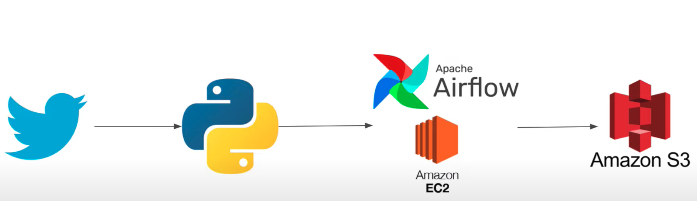

# X-Airflow-ETL-Pipeline Readme

Welcome to the X-Airflow-ETL-Pipeline project! This project aims to extract data from the Twitter API using the Tweepy Python package, perform data transformations using Pandas to convert JSON into a Pandas DataFrame, and subsequently store the clean data in a CSV file on AWS S3. The entire pipeline is orchestrated using Apache Airflow.

## Table of Contents

- [Project Overview](#project-overview)
- [Prerequisites](#prerequisites)
- [Installation](#installation)
- [Configuration](#configuration)
- [Architecture] (#architecture)

## Project Overview

In this project, I have created an ETL (Extract, Transform, Load) pipeline to handle data from the Twitter API. The pipeline is orchestrated using Apache Airflow, which allows you to schedule, monitor, and manage the various steps of the pipeline seamlessly.

The key steps of the pipeline are as follows:

1. **Data Extraction**: The project uses the Tweepy Python package to connect to the Twitter API and extract data. This raw data is typically in JSON format.

2. **Data Transformation**: The extracted JSON data is transformed using Pandas. The transformation process involves converting JSON data into a structured Pandas DataFrame, making it easier to work with and analyze.

3. **Data Loading**: Once the data is transformed and cleaned, it is saved as a CSV file. This CSV file is then uploaded to an AWS S3 bucket for storage.

4. **Orchestration with Apache Airflow**: The entire pipeline is orchestrated using Apache Airflow. Airflow allows you to define the sequence of tasks, their dependencies, and schedule them as needed.

## Prerequisites

Before you begin, ensure you have the following prerequisites:

- Python (version 3.6 or higher)
- Apache Airflow (installed and configured)
- AWS account with S3 access
- Tweepy Python package (`pip install tweepy`)
- Pandas Python package (`pip install pandas`)

## Installation

1. Clone this repository to your local machine:

   ```
   git clone https://github.com/your-username/X-Airflow-ETL-Pipeline.git
   ```

2. Navigate to the project directory:

   ```
   cd X-Airflow-ETL-Pipeline
   ```

## Configuration

1. Configure your Twitter API credentials in the appropriate configuration file. Make sure to keep these credentials secure and do not share them publicly.

2. Configure your AWS credentials or access keys in the appropriate configuration file. Again, ensure that these credentials are kept secure.

3. Set up your Apache Airflow environment and configure the necessary connections and variables according to the provided examples in the project.

## Architecture



